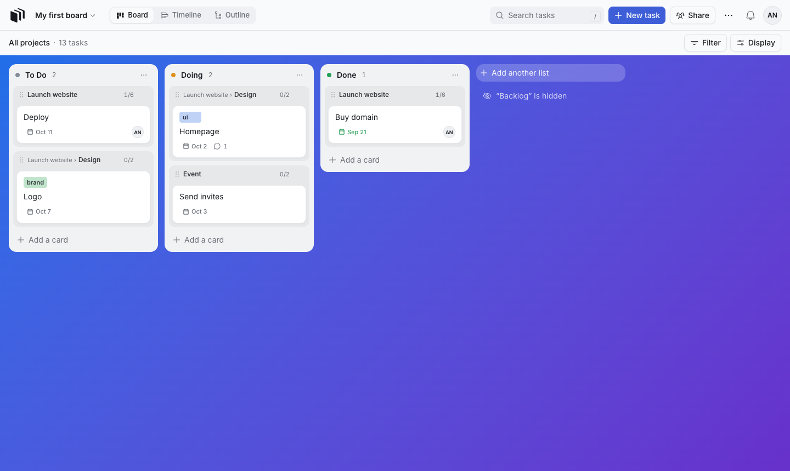
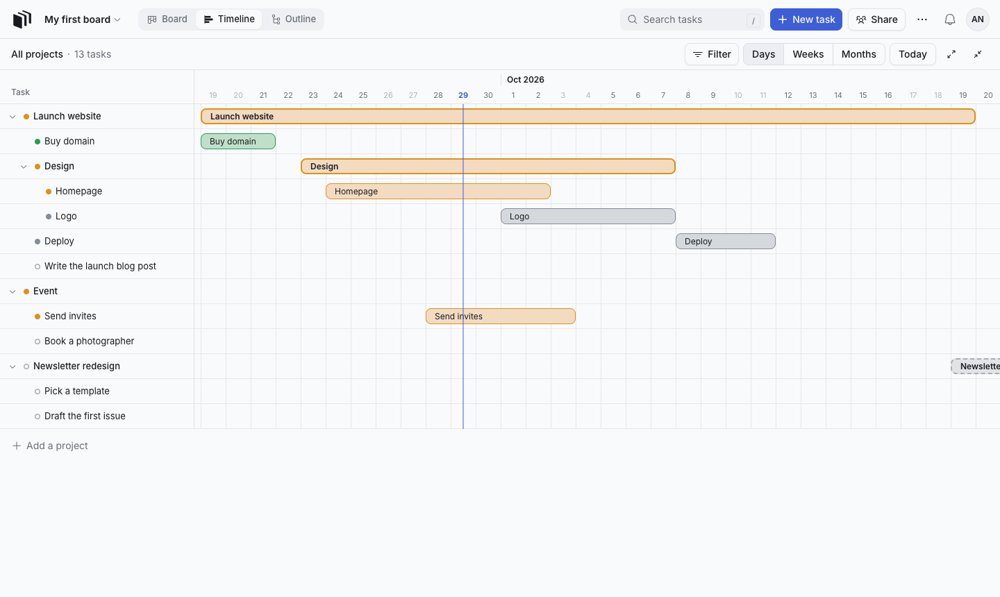
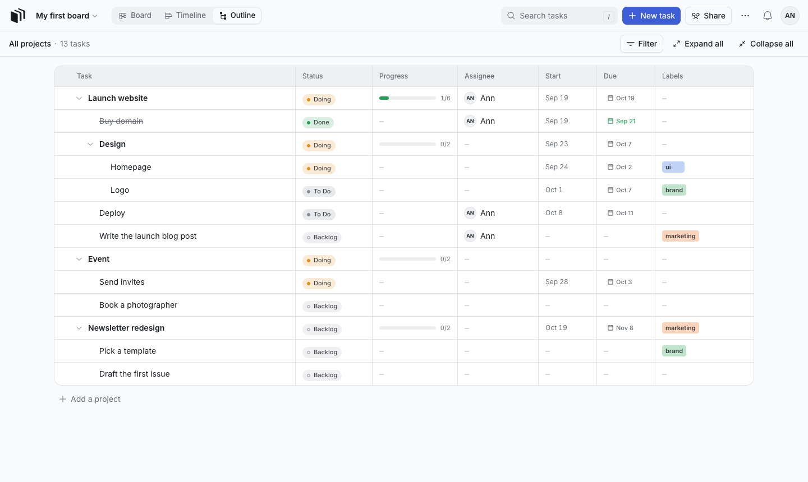
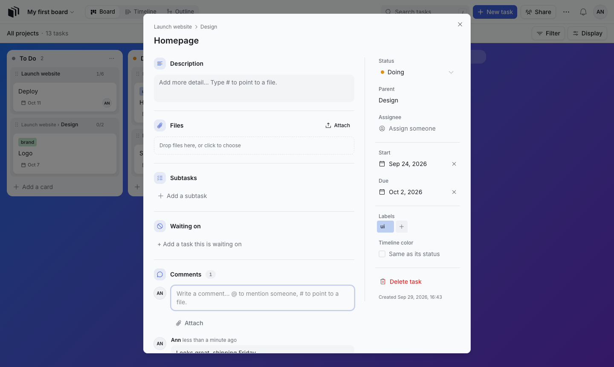

<p align="center">
  
</p>

<h1 align="center">Kanbanto</h1>

<p align="center">
  Plan projects as tasks inside tasks, and see them as a <b>Board</b>, a <b>Timeline</b> or an <b>Outline</b>.<br />
  Share boards with your team, comment, attach files, and see every change live.<br />
  Run it on your own computer or server — your data stays with you.
</p>

<p align="center">
  <a href="#run-it-on-your-computer">Get started</a> ·
  <a href="docs/self-hosting.md">Host it for a team</a> ·
  <a href="docs/troubleshooting.md">Troubleshooting</a> ·
  <a href="#license">License</a>
</p>



## What you can do

- **Tasks inside tasks, as deep as you like.** A project, its phases, their tasks and subtasks — all on one board.
- **Three views of the same work:** a **Board** with lists you name yourself, a **Timeline** you drag to reschedule,
  and an **Outline** — a table you can sort, filter and rearrange.
- **Work together:** make a workspace for your team, so everyone in it can open its boards, or share a board with a
  link, an access code or an email invite, as an owner, editor or viewer.
  Changes appear for everyone instantly.
- **Plan your people:** each workspace has a Planning tab: projects with their planned man-days, and who works on
  each one, when and how much of their time (25–100%), on a timeline by project or by person, in days, weeks or
  months. It shows which projects are under or over their plan, who is booked over 100%, and when people are free.
  Prospects (work that might not happen) are planned apart, and a project linked to a board shows its plan on that
  board's Timeline.
- **Log time:** type a card's name and the time it took ("1:30 review"); the cards you worked on that day come first.
  My week shows your time on every board, a card per row and a day per column. On a board linked to a plan, logged
  time shows next to each person's planned man-days.
- **Comments and files:** discuss each card, @mention people, attach files and screenshots, and point to a file with `#`.
- **In your calendar:** due dates and reminders show up in Google Calendar (connected once, updated within seconds),
  or in Apple Calendar, Outlook and others through a private calendar link.
- **Connect it:** an API with personal tokens, webhooks for each board, and an MCP endpoint so AI assistants like
  Claude can find, plan and update tasks for you.
- **Your own server, your own data.** Files stay on your server, or in your own Cloudflare R2 / Amazon S3 bucket.

| Timeline | Outline | A card |
|---|---|---|
|  |  |  |

## Run it on your computer

About 10 minutes, no programming needed. You'll copy and paste three commands.

### 1. Install Docker Desktop

Docker runs Kanbanto and its database for you. Download it from
[docker.com/products/docker-desktop](https://www.docker.com/products/docker-desktop/) (Mac, Windows or Linux),
install it, and **open it** — wait until it says it's running. On Windows, the installer may set up "WSL 2" and ask
you to restart your computer; that's expected.

<sub>Docker Desktop needs to be running whenever you use Kanbanto. To have it start by itself, turn on
Settings → General → **Start Docker Desktop when you sign in**.</sub>

### 2. Download Kanbanto

On [the Kanbanto GitHub page](https://github.com/baibao577/kanbanto), click the green **Code** button →
**Download ZIP**, and unzip it somewhere you'll find again (for example your Documents folder).

<sub>Comfortable with git? `git clone https://github.com/baibao577/kanbanto.git` works too, and makes updating easier.</sub>

### 3. Open a terminal in that folder

- **Mac:** open the **Terminal** app, type `cd ` (with a space), drag the Kanbanto folder into the window, press Enter.
- **Windows 11:** open the Kanbanto folder in File Explorer, right-click an empty space → **Open in Terminal**.
- **Windows 10:** open the folder, hold **Shift**, right-click an empty space → **Open PowerShell window here**.

### 4. Start Kanbanto

```bash
docker compose up -d --build --wait
```

The first time takes a few minutes (it's building Kanbanto). When your prompt comes back, it's ready: open
**<http://localhost:3000>** in your browser and click **Create an account**. You'll start with an example board to
play with.

### 5. Make yourself the admin

The admin can change settings for the whole site (email, file storage, who can sign up). Use the email you signed
up with:

```bash
docker compose exec app node dist/cli.js admin grant you@example.com
```

Refresh the page: **Platform console** now appears in the menu under your initials (top right).

**That's it.** Kanbanto keeps running in the background, even after you close the terminal.

### Everyday use

| To… | Run this in the Kanbanto folder |
|---|---|
| Stop Kanbanto | `docker compose stop` |
| Start it again | `docker compose up -d --wait` |
| See what it's doing | `docker compose logs -f app` (press Ctrl+C to stop watching) |
| Update to a new version | see below |

Your boards, accounts and files are kept safely by Docker between restarts and updates, whatever the folder is called.

**Updating:** download the new version's ZIP and unzip it. Copy everything from the new folder into your Kanbanto
folder, replacing the old files (keep your `.env` file if you made one). Then, in your Kanbanto folder:

```bash
docker compose up -d --build --wait
```

<sub>With git: `git pull`, then the same command. What changed in each version is in the [changelog](CHANGELOG.md).</sub>

**Use it from your phone or another computer** on the same Wi-Fi: open `http://<your-computer's-IP>:3000`
(for example `http://192.168.1.20:3000`). Anyone on your network can then open it and create an account: once
everyone you want has one, turn off **Anyone can create an account** in Platform console → Accounts.

### Keeping a copy of your boards

Every now and then, save a copy somewhere safe (another drive, cloud storage). In your Kanbanto folder:

```bash
docker compose exec db pg_dump -U kankan -d kankan -Fc -f /tmp/kanbanto.dump
docker compose cp db:/tmp/kanbanto.dump ./kanbanto-backup.dump
docker compose cp app:/data/uploads ./kanbanto-files
```

That's your boards and accounts (`kanbanto-backup.dump`) and attached files (`kanbanto-files`). If you've set up email
or file storage, also keep Kanbanto's encryption key in a password manager: `docker compose exec app node dist/cli.js key`
shows it. Bringing a copy back: see [Restore](docs/self-hosting.md#restore).

### Optional: email, file storage and calendars

Kanbanto works without them. Set them up any time in **Platform console**:

- **Email** — for password resets, email invites and a daily summary of @mentions. Use your organisation's mail
  server or any email service that offers SMTP, or a free [Resend](https://resend.com) account with a domain name.
  [How to set up email](docs/email.md)
- **File storage** — files are kept on your computer by default. You can use Cloudflare R2 or Amazon S3 instead.
  [How to set up storage](docs/self-hosting.md#file-storage)
- **Calendars** — let people see their cards' due dates and reminders in Google Calendar or any calendar app.
  [How to set up calendars](docs/calendar.md)

Something not working? See [Troubleshooting](docs/troubleshooting.md).

## Hosting it for a team

Running Kanbanto on a server for your company or group — with your own domain, HTTPS, backups and upgrades — is
covered step by step in the **[Self-hosting guide](docs/self-hosting.md)**.

| Guide | What's in it |
|---|---|
| [Self-hosting](docs/self-hosting.md) | Servers, HTTPS, first admin, file storage, backups, upgrades, security checklist |
| [Email](docs/email.md) | Sending email through your mail server (SMTP) or Resend |
| [Calendar](docs/calendar.md) | Cards in Google Calendar (making the Google app) and in other calendar apps (calendar links) |
| [Configuration](docs/configuration.md) | Every setting: `.env` variables, the Platform console, server commands |
| [API, webhooks and AI](docs/api.md) | API tokens, commands, webhooks and checking their signatures, connecting AI assistants (MCP) |
| [Troubleshooting](docs/troubleshooting.md) | Problems and fixes, by symptom |
| [Architecture](docs/architecture.md) | How Kanbanto works inside (for developers and curious admins) |
| [Contributing](CONTRIBUTING.md) | Running it for development, tests, conventions |
| [Security](SECURITY.md) | How to report a vulnerability, and how Kanbanto protects data |

## License

Kanbanto is **[fair-code](https://faircode.io)**, distributed under the **[Sustainable Use License](LICENSE.md)**:

- ✅ **Free** for personal use, and for any company's **internal** use — including on your own servers.
- ✅ You can read, change and share the code (free of charge, for non-commercial purposes).
- 💼 **Selling it, hosting it as a service for others, or including it in a paid product needs a commercial
  license.** To ask about one, [open a discussion or issue](https://github.com/baibao577/kanbanto/issues).

Kanbanto is source-available rather than "open source" in the OSI sense. Copyright © 2026 baibao577.
